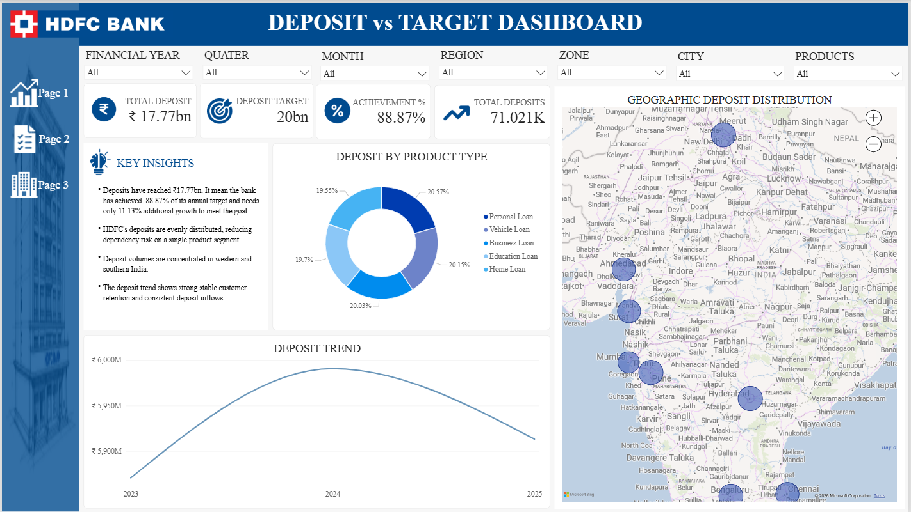

<div align="center">

<!-- Animated Header Banner -->


<!-- Badges -->


</div>

---

## 🏦 Project Overview

> **A multi-page Power BI Financial Dashboard** built on real-world structured banking data from HDFC Bank, covering deposit analytics, loan repayments, and branch-level performance tracking — all powered by a clean **Star Schema** data model and custom **DAX measures**.

This dashboard provides end-to-end visibility into:
- 📊 **Deposit vs. Target performance** across branches, regions, and product types
- 🗺️ **Geographic distribution** of deposits across India
- 📈 **Trend analysis** across financial years, quarters, and months
- 🏷️ **Loan repayment** tracking and outstanding balance monitoring

---

## 📁 Folder Structure

```
📦 HDFC Bank/
├── 📂 Assets/                        # Icons, logos, and design assets
├── 📂 HDFC_Bank_Dataset/             # Raw source data (CSV files)
│   ├── 📄 DimAccount.csv             # 100,000 customer accounts
│   ├── 📄 DimBranch.csv              # 500 branches with city/region/zone
│   ├── 📄 DimDate.csv                # Date dimension (2023–2025)
│   ├── 📄 DimProduct.csv             # 10 product types (loans, savings)
│   ├── 📄 BranchDepositTargets.csv   # 18,000 branch deposit targets
│   ├── 📄 FactTransactions.csv       # 500,000 transaction records
│   └── 📄 FactLoanRepayments.csv     # 150,000 loan repayment records
├── 📂 Screenshots/                   # Dashboard page previews
│   ├── 🖼️ Model_View.png             # Star schema model view
│   ├── 🖼️ Page1_Dashboard.png        # Deposit vs Target page
│   ├── 🖼️ Page2_Dashboard.png        # Page 2 overview
│   └── 🖼️ Page3_Dashboard.png        # Page 3 overview
└── 📊 HDFC Financial Dashboard.pbix  # Main Power BI file
```

---

## 📐 Data Model — Star Schema

<div align="center">

> Clean **Star Schema** connecting two fact tables to four dimension tables for flexible, performant analytics.


</div>

| Table | Type | Rows | Key Fields |
|---|---|---|---|
| `FactTransactions` | Fact | 500,000 | TransactionID, AccountID, BranchID, DateKey, Amount |
| `FactLoanRepayments` | Fact | 150,000 | RepaymentID, AccountID, BranchID, EMIAmount, OutstandingBalance |
| `BranchDepositTargets` | Fact | 18,000 | BranchID, Year, Month, DepositTarget |
| `DimAccount` | Dimension | 100,000 | AccountID, CustomerName, BranchID, ProductCode |
| `DimBranch` | Dimension | 500 | BranchID, BranchName, City, Zone, Region |
| `DimDate` | Dimension | 1,096 | DateKey, Year, Quarter, Month, MonthName |
| `DimProduct` | Dimension | 10 | ProductCode, ProductName |

---

## 📊 Dashboard Pages

### 📌 Page 1 — Deposit vs Target Dashboard

<div align="center">



</div>

**Key Visuals:**
- 💰 **KPI Cards** — Total Deposit (₹17.77bn), Target (₹20bn), Achievement % (88.87%), Total Deposits Count
- 🍩 **Donut Chart** — Deposit by Product Type (Personal Loan, Vehicle Loan, Business Loan, Education Loan, Home Loan)
- 📉 **Line Chart** — Deposit Trend from 2023 → 2025
- 🗺️ **Map Visual** — Geographic Deposit Distribution across India
- 💡 **Key Insights Card** — Auto-generated business insights
- 🔽 **Slicers** — Financial Year, Quarter, Month, Region, Zone, City, Products

---

### 📌 Page 2 — *(Branch & Loan Analytics)*

> Drill-down into branch-level performance, loan repayment tracking, and outstanding balances segmented by product and geography.

---

### 📌 Page 3 — *(Executive Summary)*

> High-level executive view summarising overall bank health, deposit growth YoY, and target gap analysis.

---

## ⚙️ DAX Measures Highlights

```dax
-- Total Deposit Amount
Total Deposit = SUM(FactTransactions[Amount])

-- Deposit Target
Deposit Target = SUM(BranchDepositTargets[DepositTarget])

-- Achievement %
Achievement % = DIVIDE([Total Deposit], [Deposit Target], 0)

-- Gap to Target
Gap to Target = [Deposit Target] - [Total Deposit]
```

---

## 🛠️ Tools & Technologies

<div align="center">

| Tool | Usage |
|---|---|
| **Microsoft Power BI Desktop** | Dashboard design, DAX, visuals |
| **Power Query (M Language)** | Data transformation & cleaning |
| **DAX** | Calculated columns & measures |
| **Star Schema Modeling** | Relational data architecture |
| **Bing Maps (Power BI)** | Geographic distribution visual |
| **CSV / Excel** | Raw data source format |

</div>

---

## 🚀 How to Use

```bash
# 1. Clone or download this repository
git clone https://github.com/renseegajipara/hdfc-financial-dashboard.git

# 2. Open the dataset folder
cd "HDFC_Bank_Dataset"

# 3. Open the Power BI file
# Double-click: HDFC Financial Dashboard.pbix
# Or open via Power BI Desktop → File → Open
```

> ⚠️ **Note:** If prompted, refresh the data source paths to point to your local `HDFC_Bank_Dataset/` folder.

---

## 📂 Dataset Summary

| File | Records | Description |
|---|---|---|
| `FactTransactions.csv` | 500,000 | All banking transactions (deposits, withdrawals) |
| `FactLoanRepayments.csv` | 150,000 | EMI payments and outstanding loan balances |
| `BranchDepositTargets.csv` | 18,000 | Monthly deposit targets per branch |
| `DimAccount.csv` | 100,000 | Customer account master data |
| `DimBranch.csv` | 500 | Branch details (city, region, zone) |
| `DimDate.csv` | 1,096 | Full date dimension (2023–2025) |
| `DimProduct.csv` | 10 | Product catalogue (loan types, savings) |

---

## 👨‍💻 Author

<div align="center">


### ✨ Rensee Gajipara

[](https://github.com/renseegajipara)
[](https://linkedin.com/in/renseegajipara)
[](https://github.com/renseegajipara)

> 💼 *Data Analytics Enthusiast | Power BI Developer | Star Schema Designer*
> 
> 🌍 *Surat, Gujarat, India*


</div>

---

<div align="center">

<!-- Stickers / Emojis Section -->
> 🏆 Built with passion for data &nbsp;|&nbsp; 📊 Powered by Power BI &nbsp;|&nbsp; 🇮🇳 Made in India


*⭐ If you found this project useful, please consider starring the repository!*

</div>
